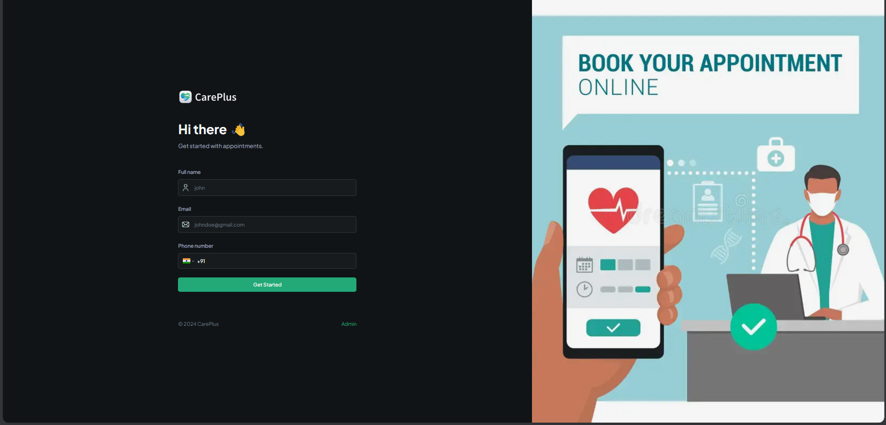

# CarePlus: An Online Appointment System 🏥

 <!-- Replace with your actual image path or URL -->

CarePlus is an innovative healthcare platform designed to simplify appointment scheduling and enhance communication between patients and doctors. Developed during the **Hackloop Hackathon**, this project leverages cutting-edge technology to create a seamless experience for users.

## 🚀 Features

- **Patient Management**: Store and manage patient details, including medical history and insurance information.
- **Appointment Scheduling**: Book, update, and cancel appointments with real-time notifications.
- **Doctor Dashboard**: A dedicated space for doctors to manage appointments and patient details.
- **Secure Data Handling**: Privacy-focused with consent management and encrypted data storage.
- **Modern UI**: User-friendly interface built with Tailwind CSS.
- **Responsive Design**: Works across desktop and mobile devices.

## 🛠️ Tech Stack

- **Frontend**: [Next.js](https://nextjs.org/), [Tailwind CSS](https://tailwindcss.com/), [TypeScript](https://www.typescriptlang.org/)
- **Backend**: [Node.js](https://nodejs.org/), [Appwrite](https://appwrite.io/)
- **Real-Time Features**: [Twilio](https://www.twilio.com/) for SMS and OTP verification
- **State Management**: Context API and React Hooks
- **Validation**: Zod for schema validation

## 📂 Project Structure

**codexplore-careplus/**

- components: Reusable UI components
- pages: Application pages
- lib: Utilities and helpers
- types: TypeScript type definitions
- public: Static assets
- styles: Tailwind CSS styles
- constants: Shared constants

## ⚙️ Setup and Installation

1. Clone the repository:
   ```bash
   git clone https://github.com/Sahana-Pixel/codexplore-careplus.git
   cd codexplore-careplus
   ```

**Installation**

Install the project dependencies using npm:

```bash
npm install
```

**Set Up Environment Variables**

Create a new file named `.env.local` in the root of your project and add the following content:

```env
#APPWRITE
NEXT_PUBLIC_ENDPOINT=https://cloud.appwrite.io/v1
PROJECT_ID=
API_KEY=
DATABASE_ID=
PATIENT_COLLECTION_ID=
APPOINTMENT_COLLECTION_ID=
NEXT_PUBLIC_BUCKET_ID=

NEXT_PUBLIC_ADMIN_PASSKEY=111111
```

Replace the placeholder values with your actual Appwrite credentials. You can obtain these credentials by signing up on the [Appwrite website](https://appwrite.io/).

**Running the Project**

```bash
npm run dev
```

Open [http://localhost:3000](http://localhost:3000) in your browser to view the project.

## 🧩 Features in Detail

- **For Patients**: Secure patient registration with OTP verification, Manage personal and medical details, View, schedule, and cancel appointments
- **For Doctors**: View upcoming appointments, Approve or reject appointment requests, Manage patient details and notes
- **Admin Features**: Manage patient records, Handle cancellation and scheduling policies

## 🙌 Acknowledgements

- Appwrite for the backend framework
- Twilio for SMS and OTP services
- Next.js for powering the frontend
- The open-source community for the libraries and tools used

Made with ❤️ by CodeXplore team
